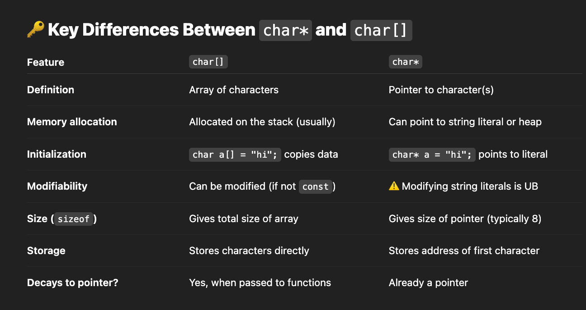

# Cheatsheet

## Functions
1) Arrays
- Size of array: sizeof(a)/sizeof(a[0])
- Fill array with 0 - memset(a, 0, sizeof(a));

2) Char
- cin.get(s, 10); // take input of a string
- cin.get(); //cin.ignore(); // use to ignore enter pressed after input
- instead of that, point 1 n 2, use -- cin.getline(x, 10);
- Functions:
isalnum(c) → Checks if c is alphanumeric (letter or digit).
isalpha(c) → Checks if c is a letter (A-Z, a-z).
islower(c) → Checks if c is a lowercase letter.
isupper(c) → Checks if c is an uppercase letter.
isdigit(c) → Checks if c is a digit (0-9).
isspace(c) → Checks if c is a whitespace character.
isblank(c) → Checks if c is a blank space.
ispunct(c) → Checks if c is a punctuation mark.
tolower(c) → Converts c to lowercase.
toupper(c) → Converts c to uppercase.
strlen(str) → Returns the length of the string.
strcmp(str1, str2) → Compares two strings.
strcpy(dest, src) → Copies src to dest.
strncpy(dest, src, n) → Copies first n characters of src to dest.
strcat(dest, src) → Appends src to dest.
strncat(dest, src, n) → Appends first n characters of src to dest.
char ch = 'a';
string str(1, ch); → Converts char to string.

string str = "Hello, How are you?";
char* ptr = strtok((char *)str.c_str(), " ");

3) Strings
- String i/o
    char *s= NULL; // null string - char pointer not pointing to anything - dangerous to handle - not a valid string - shows undefined behaviour
    string s0; // null string
    string s1="Hello", s2("ji"), s3(s2);
    string s4=s3;
    char a[] ={'j','o','\0'};
    getline(cin, s5);
    cout<<s0<<" "<<s1<<" "<<s2<<" "<<s3<<" "<<s4<<" "<<s5<<endl;
- C++ String Functions
- `str1 + str2` – Concatenates two strings.  
- `str1.append(str2);` – Appends `str2` to `str1`.  

- `str[index]` – Accesses character at the given index.  
- `str.at(index);` – Accesses character at the given index with bounds checking.

- `str.front();` – Returns the first character of the string.  
- `str.back();` – Returns the last character of the string.  
- `str.push_back('A');` – Appends character(s) at the end.  
- `str.pop_back();` – Removes the last character.  

- `str.length();` – Returns the length of the string.  
- `str.size();` – Returns the number of characters (same as `length()`).  
- `str.capacity();` – Returns the storage capacity of the string.  
- `str.empty();` – Checks if the string is empty.  
- `str.resize(new_size);` – Resizes the string to the given size.  

- `str.substr(pos, len);` – Extracts a substring from the string.  
- `str.find("word");` – Finds the first occurrence of "word".  
- `str.rfind("word");` – Finds the last occurrence of "word".  
- `str1.compare(str2);` – Compares two strings lexicographically.  

- `str.insert(pos, "text");` – Inserts "text" at a given position.  
- `str.erase(pos, len);` – Erases `len` characters from `pos`.  
- `str.replace(pos, len, "new text");` – Replaces a portion with new text.  

- `std::stoi(str);` – Converts string to an integer.  
- `std::stol(str);` – Converts string to a long.  
- `std::to_string(num);` – Converts a number to a string.
- `str.c_str();` – Returns a `const char*` (C-style string).
- `str a(c)` - char array to string where c is char* array

- `std::transform(str.begin(), str.end(), str.begin(), ::toupper);` – Converts to uppercase.  
- `std::transform(str.begin(), str.end(), str.begin(), ::tolower);` – Converts to lowercase.  
- `if(a.find(b) != string::npos) return true;` check if string b is a substring of a or not

4) STL
The C++ Standard Template Library (STL) is a powerful set of generic classes and functions that provide common data structures and algorithms. It includes containers, iterators, algorithms, and function objects, making it easier to write efficient and reusable code.

5.1-Containers
Sequential Containers: vector, deque, list, forward_list, array, string
Associative Containers: set, multiset, map, multimap
Unordered Containers: unordered_set, unordered_multiset, unordered_map, unordered_multimap
Adapter: stack, queue, priority_queue

5.2-Iterators
Input Iterator: istream_iterator
Output Iterator: ostream_iterator
Forward Iterator: forward_list
Bidirectional Iterator: list, set, map
Random Access Iterator: vector, deque
Types: begin(), end(), rbegin(), const_iterator, etc.

5.3-Algorithms
#include<algorithm>
- Sorting: sort()
Introsort begins with quicksort. If the recursion depth becomes too large, indicating a potential worst-case scenario for quicksort, 
it switches to heapsort. Finally, insertion sort is used on small subarrays to improve performance. This strategy ensures that std::sort 
provides an average time complexity of O(n log n) with a worst-case guarantee of O(n log n), making it a robust and efficient sorting algorithm.
- Searching: binary_search(), find(), equal_range()
- Modifying: {copy(), replace(), fill()} - belong to algorithm library, emplace() -container method
fill(begin(a), end(a), 0);
for(int i = 0; i < 3; i++)
    fill(begin(a[i]), end(a[i]), 0);
- Numeric: accumulate(), inner_product(), partial_sum()
- Set Operations: set_union(), set_intersection()
- min n max - min() max()
- reverse(), count(), lower_bound(), upper_bound(), rotate(), *min_element, *max_element, equal(), distance()

5.4-Function Objects (Functors)
greater<T>(), less<T>(), equal_to<T>(), Custom functors

5.5-Utility Components
pair, tuple, optional, variant, any, make_pair(), swap(), move(),
std::next(iterator it, int n = 1);  // moves forward by n
std::prev(iterator it, int n = 1);  // moves backward by n
- Utility - Pair
#include <utility> 
- pair<int, string> p = {1, "Hello"};
- p.first=1; p.second="hi";
- pair<int, string> p2(p);
- pair<int, char> p1(10, 'A');  // Using constructor
- pair<string, double> p2 = make_pair("Price", 99.99); // Using make_pair
- map m.insert(pair<int, string>(2, "Two"));

6) Miscellaneous
- #include<climits>: INT_MIN, INT_MAX
- inline/lambda function: bubbleSortComp(a, n,  { return a < b; });

## Concepts
- Sliding Window/Two Pointer
1) Constant k - constant window size
2) Longest subarray/substring with sum<=k
3) No. of subarray with sum = k

## Notes:
1) run code in vscode
- g++ STLsort.cpp -o a
- ./a
[OR]
- g++ STLsort.cpp
- ./a.out

2) Introduction
- Read input as fast as possible: https://www.geeksforgeeks.org/fast-io-for-competitive-programming/ ;  
detailed explanation: https://stackoverflow.com/questions/31162367/significance-of-ios-basesync-with-stdiofalse-cin-tienull
- STL <https://www.geeksforgeeks.org/the-c-standard-template-library-stl/>
- https://www.geeksforgeeks.org/pass-array-to-functions-in-cpp/
- https://www.geeksforgeeks.org/pass-2d-array-parameter-to-functions-in-cpp/
- https://www.geeksforgeeks.org/difference-between-null-strings-and-empty-string-in-cpp/
- https://www.geeksforgeeks.org/whats-difference-between-char-s-and-char-s-in-c/ 
- https://www.geeksforgeeks.org/memory-layout-of-c-program/
- https://www.youtube.com/watch?v=m1UzSfgjA4Y 
- https://stackoverflow.com/questions/42638999/why-cant-i-increment-an-array
- https://www.bigocheatsheet.com/
- https://www.baeldung.com/cs/compiler-linker-assembler-loader
- https://www.geeksforgeeks.org/difference-between-linker-and-loader/
- sort() - By default, it uses QuickSort, but if QuickSort is doing unfair partitioning and taking more than N*logN time, it switches to HeapSort. When the array size becomes very small, it switches to InsertionSort. 
- Boolean Comparator
- C++ libraries list
- C++ STL
- For binary search and two pointer approach the array must always be sorted.
- Total no. of:
Subarray/substring = n*(n+1)/2
Subseqeunce/Subset = (2^n) -1 (non-empty subsequences) or 2^n
- memset(a,0,n); - works on 1d array
- dp[100][100] = {0} do this for 2d array or use vectors or loops to fill 0
- vector<vector<int>> dp(m, vector<int>(n, 0));
- Study - 0-GeneralConcepts folder

3) Trim a string
size_t start = 0;
while (start < s.size() && isspace(s[start])) start++;
size_t end = s.size();
while (end > start && isspace(s[end - 1])) end--;
s = s.substr(start, end - start);

4) Array Passing
- In cpp all arrays are always passed as pointers!

* Pass 1D array to a function *
- Using a Pointer (Decay to Pointer): void func(int *arr, int size) : Array decays to a pointer, losing its original size.
- Using Array Syntax: void func(int arr[], int size) : same as above -- use this
- Using Fixed-Size Array: void func(int arr[3]) : Only works for fixed-size arrays
- Using References: void func(int (&arr)[3]) : Preserves size, doesn’t decay to a pointer, Works only for arrays of fixed size.

* Pass 2D array to a function *
- Use a Pointer to Pointer: void printArray(int** arr, int rows, int cols)
- Using Pointer: void printArray(int (*arr)[3], int rows)
//void printArray(int arr[2][3]); eventually decays to a pointer *arr[3]
- Using Array Syntax: void printArray(int arr[][3], int rows) 
- Using Fixes sizes: void printArray(int arr[2][3])
- Using Reference: void printArray(int (&arr)[2][3])

* diff between array and pointer
Key Points for Pointers to Arrays:
Increment (p++):
Valid for pointers: The pointer can be incremented to point to the next element in the array (p++ moves to the next element).
Invalid for arrays: You cannot increment the array itself, as the array name is a constant pointer.

Reassignment (p = new_value):
Valid for pointers: You can reassign a pointer to point to a different memory location or part of an array.
Invalid for arrays: The array name is fixed, and you cannot reassign the array.

Reinitialize (p = {new_values}):
Valid for pointers: The pointer can be reassigned to another location or array.
Invalid for arrays: You cannot "reinitialize" an array once it has been defined.

Mutability (Modifiable contents):
Valid for pointers: You can modify the contents of the array or string that the pointer points to (*p = value or p[0] = 'x';).
Valid for arrays: You can modify individual elements of the array (a[0] = 9; or str[0] = 'H';).
For strings: You can modify the characters if the string is not a string literal (e.g., *p = 'x'; for char *p).

Mutability (Array itself):
Valid for pointers: The pointer itself can be reassigned to point to a different memory location or array.
Invalid for arrays: The array itself cannot be reassigned or moved in memory.

* char array exception
char *p = "haseeb"
you cant do p[0]='x'; as haseeb is stored in code section of the memory

* array pointers
int a[] = {1, 2, 3};
cout << "a       (int*):     " << a << endl; // 0x16bb62a78
cout << "&a[0]   (int*):     " << &a[0] << endl; // 0x16bb62a78
cout << "&a      (int (*)[3]): " << &a << endl; // 0x16bb62a78 - same as above but type is diff
--- hence a = &a = &a[0]
cout << "&a + 1  (next array): " << (&a + 1) << endl; // 0x16bb62a84 - similar to whole a + 1
cout << "a + 1  (next array element): " << (a + 1) << endl; // 0x16b5c6a7c - similar to &a[0] + 1

* ASCII Values
- A-Z: 65-90
- a-z: 97-122
- space: 32
- 0-9: 48-57

- Convert char digit to int: 
char ch = '7';
int digit = ch - '0';  // 55 - 48 = 7
- Convert int digit to char:
int digit = 7;
char ch = digit + '0';  // 7 + 48 = 55 → '7'
- Map capital letters (A–Z) to values (e.g., 0–25 or 1–26):
char ch = 'C';
int val = ch - 'A';  // 67 - 65 = 2  (0-based)
int val = ch - 'A' + 1;  // = 3 (1-based)

- sum += (v[i] + k - 1) / k;  // equivalent to ceil(v[i] / k) -- ceil(a / b)
- ceil(a / b) ≡ (a + b - 1) / b

- cout << fixed << setprecision(p) << sqroot(n, p);
- double result = sqroot(n, p);
stringstream ss;
ss << fixed << setprecision(p) << result;
string formattedResult = ss.str();

- string s1, s2;
size_t f = s1.find(s2);
if(f != string::npos) cout<<"found"<<endl;
(or) if(s1.find(s2) != string::npos) cout<<"found"<<endl;

----
Two pointer approach - lower envelope technique
Binary Search - sorted, monotonic search space
----

## TODO
- sliding window
- macros
- tertiary operator time
1) https://www.geeksforgeeks.org/maximum-xor-of-two-numbers-in-an-array/
2) Prime Seive TLE
3) https://github.com/UMANG-GAKHAR/Hackerblocks-practice/blob/master/Prateek%20Loves%20Candy.cpp
4) Binary Search EKO/DEFKIN Problem SPOJ
5) todo - quiz on sorting, quiz on divide and conquer
6) check string uppercase or lowercase
7) return array through a function
8) shell sort n radix sort
9) Backtracking webinar
10) math functions - sqrt() etc
11) tile 2 recursion - use dp
12) vector initialisation + resize to reduce time required for allocation of new push back
13) Find the duplicate in an array of N+1 integers : duplicate element in an array - linked list method
https://www.youtube.com/watch?v=32Ll35mhWg0
14) Duplicates in an array in O(n) time and by using O(1) extra space | Set-3
https://www.geeksforgeeks.org/duplicates-in-an-array-in-on-time-and-by-using-o1-extra-space-set-3/?ref=ml_lbp 
15) Moore's voting algo
16) oops webinar 1 & 2 - operator n function overloading | vectors n cpp stl
17) OOPS
18) Reverse a LinkedList in groups of size k - learn recursive soln
19) Problems related to BTN and stack - see green book initial pages
20) efficient approach for pre and in to tree : https://www.geeksforgeeks.org/construct-tree-from-given-inorder-and-preorder-traversal/
21) emplace and const like basic things in cpp
22) hash, heap, trees, stack, greedy, DP quizzes
23) Huffman Coding
24) Matrix Multiplication and Matrix Exponentiation revise
25) PALINDROME SUBSEQUENCE - REVERSE N LCS -- think
26) daily temp, next greater element - mono stack
27) Fibonacci - matrix exponentiation
28) learn how to use 1d dp in 2d dp problems
29) emplace() and emplace_back() in unordered_map ---- IMPPP
30) see how to do 3 sum two pointer approach using hashing which reduces the O(n^2) complexity
31) use direct comp function in sort: lambda funcs + functors
32) https://www.geeksforgeeks.org/window-sliding-technique/
33) sort map

## Part 1: Array & Hashing
- we cant sort maps, unordered_map, set and unordered_set (we can only sort random access iterators/sequence containers)
- unique/duplicate elements - think of set
- https://neetcode.io/problems/string-encode-and-decode